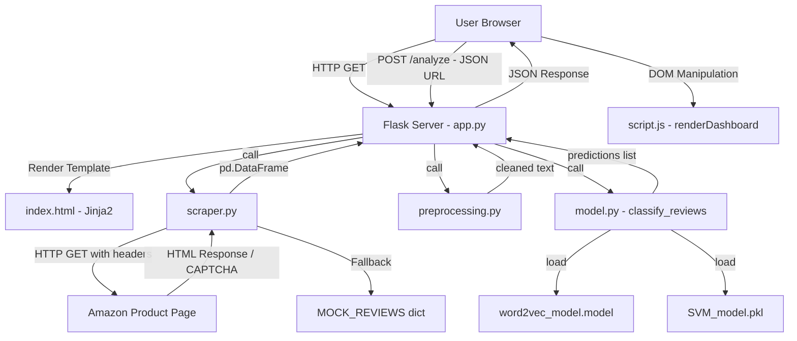

#  Fake Review Detection — Complete Interview Preparation Guide

> **Prepared by:** Antigravity AI  
> **Project Author:** Suman Kumar  
> **Stack:** Python · Flask · Word2Vec · SVM · BeautifulSoup · NLTK · Tailwind CSS  
> **Role Simulation:** Senior Software Engineer · System Architect · Technical Interviewer · Product Manager

---

#  TABLE OF CONTENTS

1. [Project Overview](#1-project-overview)
2. [Features](#2-features)
3. [System Architecture](#3-system-architecture)
4. [Technology Stack](#4-technology-stack)
5. [Folder Structure](#5-folder-structure)
6. [Database Design](#6-database-design)
7. [Backend — Deep Dive](#7-backend)
8. [Frontend — Deep Dive](#8-frontend)
9. [APIs](#9-apis)
10. [Authentication Flow](#10-authentication-flow)
11. [Complete User Flow](#11-complete-user-flow)
12. [Data Flow](#12-data-flow)
13. [Important Algorithms](#13-important-algorithms)
14. [Design Patterns](#14-design-patterns)
15. [Security](#15-security)
16. [Performance Optimisation](#16-performance-optimisation)
17. [Deployment](#17-deployment)
18. [Challenges Faced](#18-challenges-faced)
19. [Future Improvements](#19-future-improvements)
20. [75 Technical Interview Questions](#20-technical-interview-questions)
21. [30 HR Questions](#21-hr-questions)
22. [50 Deep Technical Follow-up Questions](#22-deep-technical-follow-up-questions)
23. [Explain Every Line of Code](#23-explain-every-line-of-code)
24. [Code Inefficiencies & Improvements](#24-code-inefficiencies--improvements)
25. [Mock Interview](#25-mock-interview)

---

---

# 1. PROJECT OVERVIEW

##  Problem Statement

**Simple English:** When you shop online on Amazon, you cannot always trust the star ratings and reviews. Sellers pay for fake positive reviews written by bots or paid humans. This misleads genuine buyers into purchasing low-quality products.

**Technical Explanation:** The proliferation of Computer-Generated (CG) reviews — written by automated bots, click farms, or AI tools — distorts product trust signals on e-commerce platforms. This project applies supervised Machine Learning to detect such fraudulent reviews by classifying them as either **Computer Generated (CG)** or **Original/Real (OR)** using NLP feature extraction combined with an SVM classifier.

---

##  Why This Project Was Built

- Online review manipulation is a **$152 billion dollar fraud** problem (as per market research).
- Platforms like Amazon struggle to fully prevent review manipulation at scale.
- NLP + ML can analyse linguistic patterns at speed and scale impossible for human reviewers.
- This project demonstrates applied ML, NLP, and full-stack web development skills.

---

##  Real-World Use Cases

| Use Case | Description |
|---|---|
| **Consumer Protection** | Buyers can verify if a product's reviews are organic before purchasing |
| **E-commerce Platform Auditing** | Amazon/Flipkart can integrate this to auto-flag suspicious reviews |
| **Brand Reputation Management** | Brands can detect if competitors are using fake reviews against them |
| **Regulatory Compliance** | FTC regulations require platforms to disclose paid/fake reviews |
| **Journalism & Research** | Researchers can audit product categories for review manipulation trends |

---

##  Target Users

1. **Consumers** — Everyday shoppers who want trusted product insights
2. **E-commerce Operators** — Marketplace teams running review quality pipelines
3. **Data Scientists** — Who need a baseline ML solution for text classification
4. **Browser Extension Developers** — Who can wrap this API inside a Chrome extension

---

##  Business Value

- Reduces consumer deception → increases brand trust
- Demonstrates NLP + ML expertise suitable for roles in fintech, e-commerce, content moderation, and fraud detection
- Scalable architecture: one API endpoint that can be consumed by mobile apps, browser extensions, or internal dashboards

---

---

# 2. FEATURES

##  Feature 1: Amazon URL-Based Review Scraping

**What it does:** Takes a user-provided Amazon product URL, sends an HTTP GET request with browser-like headers, parses the HTML response using BeautifulSoup, and extracts review text and star ratings.

**Why it exists:** Without scraping, the app cannot access real product reviews. The scraper bridges the gap between the live Amazon page and the ML pipeline.

**User Workflow:**
1. User pastes a URL → clicks "Run Detection"
2. Flask backend receives the URL → `scraper.py` fetches page HTML
3. BeautifulSoup parses review blocks → returns a `DataFrame`

**Edge Cases Handled:**
- CAPTCHA detection → falls back to mock reviews
- Non-English reviews → filtered using `langdetect`
- "Read more" truncated reviews → attempts to get full text
- Empty result → returns demo dataset

---

##  Feature 2: Demo Mode with Pre-scraped Mock Reviews

**What it does:** When Amazon's bot-protection blocks scraping, the app does NOT show an error. Instead it loads hand-crafted demo reviews for 4 categories: headphones, kindle, chair, and generic products.

**Why it exists:** Amazon aggressively blocks automated scrapers. Without a fallback, the app would almost always fail in a demo. This ensures the ML pipeline is always showcaseable.

**User Workflow:** User gets a yellow warning banner: "Amazon Bot Protection Triggered — Loading demo reviews" and the analysis proceeds normally.

---

##  Feature 3: NLP Text Preprocessing Pipeline

**What it does:** Transforms raw messy text into a clean, normalized, machine-learnable format through 8 steps:
1. Lowercase + strip whitespace
2. Replace currency symbols with words
3. Expand numerical abbreviations (1000 → 1k)
4. Expand contractions (can't → cannot)
5. Remove HTML tags
6. Convert emojis to text descriptions
7. Remove stopwords
8. Apply lemmatization + stemming

**Why it exists:** Raw review text is noisy. "Can't WAIT!!!" and "cannot wait" mean the same thing but would be treated as completely different tokens by a model without preprocessing.

---

##  Feature 4: Word2Vec Text Embedding

**What it does:** Converts preprocessed review text into a 100-dimensional numerical vector by averaging the Word2Vec embeddings of all words in the review.

**Why it exists:** ML models cannot work on raw strings — they need numbers. Word2Vec captures semantic meaning: "good" and "great" will have similar vectors. TF-IDF was considered but Word2Vec captures context better.

---

##  Feature 5: SVM Classification

**What it does:** Takes a 102-dimensional combined feature vector (rating[1] + word_length[1] + word2vec_embedding[100]) and predicts 0 (Real) or 1 (Fake).

**Why it exists:** SVM is known to perform excellently on high-dimensional text classification tasks with relatively small datasets. It generalises well and avoids overfitting compared to deep learning models on small corpora.

---

##  Feature 6: Confidence Score Calculation

**What it does:** Uses `svm_model.decision_function()` to get a raw distance from the hyperplane, then passes it through a sigmoid function to get a probability-like confidence percentage.

**Why it exists:** A binary prediction (Real/Fake) alone is not enough for users. A confidence score (e.g., "87.3% confident this is Fake") gives users actionable insight into borderline predictions.

---

##  Feature 7: Statistical Dashboard

**What it does:** Renders a visual dashboard after analysis showing:
- **Product Trust Score**: % of real reviews (animated SVG circle gauge)
- **Verified Genuine Count**: with animated progress bar
- **Suspicious/Fake Count**: with animated progress bar
- **Colour-coded trust descriptions** (green=high trust, amber=moderate, red=low trust)

---

##  Feature 8: Per-Review Linguistic Details (Accordion)

**What it does:** Each review card has a toggle button revealing:
- Model Confidence %
- Word Count
- Capitalization Ratio %
- Average Word Length

**Why it exists:** Provides transparency — users can understand WHY a review was flagged. High capitalization ratio is a spam signal. Very short word count can indicate bot-generated text.

---

##  Feature 9: Quick Demo Products

**What it does:** 4 preset product buttons (Sony XM4, Kindle Paperwhite, Ergonomic Chair, Generic) auto-fill the URL input and trigger analysis with a single click.

**Why it exists:** Removes friction for users who want to see the system in action immediately without manually finding an Amazon URL.

---

---

# 3. SYSTEM ARCHITECTURE

##  Overall Architecture Diagram



---

##  Frontend Architecture

```
Browser
  └── index.html (Jinja2 template rendered by Flask)
        ├── Tailwind CSS (CDN) — Utility-first styling
        ├── Font Awesome (CDN) — Icon library
        ├── Google Fonts - Outfit (CDN) — Typography
        ├── style.css (custom) — Glassmorphism, animations, badges
        └── script.js (custom) — All client-side logic
              ├── analyzeReviews() — Sends POST /analyze
              ├── renderDashboard() — Renders stats + review cards
              ├── loadDemoProduct() — Prefills URL + triggers analysis
              ├── showError() — Error display
              ├── clearResults() — Resets UI
              └── toggleAccordion() — Expands linguistic details
```

**No frontend framework** (React/Vue) is used — this is intentional. The application is server-rendered (Flask/Jinja2) with vanilla JavaScript handling async API calls and DOM updates. This keeps the bundle size minimal.

---

##  Backend Architecture

```
Flask Application (app.py)
  ├── Route: GET /  → renders index.html
  ├── Route: POST /analyze → main pipeline
  │     ├── Input Validation (url present?)
  │     ├── scraper.py → scrape_reviews(url)
  │     │     ├── detect_product_category(url)
  │     │     ├── HTTP GET with fake browser headers
  │     │     ├── CAPTCHA check → fallback
  │     │     ├── BeautifulSoup parsing
  │     │     ├── Language detection (langdetect)
  │     │     └── Returns (DataFrame, is_demo: bool)
  │     ├── preprocessing.py → preprocess_text(review)
  │     │     ├── Lowercase + strip
  │     │     ├── Symbol replacement
  │     │     ├── Contraction expansion
  │     │     ├── HTML tag removal
  │     │     ├── Emoji demojization
  │     │     └── Lemmatization + Stemming
  │     └── model.py → classify_reviews(reviews, w2v, svm)
  │           ├── Word2Vec embedding (avg pooling)
  │           ├── Feature combination (rating + length + vector)
  │           ├── SVM predict()
  │           ├── decision_function() → sigmoid → confidence
  │           └── Returns list of prediction dicts
  └── App startup: load_models() called ONCE at boot
```

---

##  Request–Response Lifecycle

```
1. Browser: User clicks "Run Detection"
2. JS: fetch() POST to /analyze with {url: "https://amazon.com/..."}
3. Flask: Receives request.json → extracts URL
4. Flask: Validates URL is non-empty
5. Scraper: HTTP GET to Amazon with browser-mimicking headers
6. Scraper: Detects CAPTCHA OR parses HTML with BeautifulSoup
7. Scraper: Filters non-English reviews via langdetect
8. Scraper: Returns (DataFrame, is_demo=True/False)
9. App: Iterates reviews → calls preprocess_text() per review
10. App: Builds list of {Review Text, Rating, Original Review Text}
11. Model: classify_reviews() → Word2Vec embed each review
12. Model: hstack(rating, length, text_vector) → SVM predict
13. Model: decision_function() → sigmoid → confidence %
14. App: Zips preprocessed_reviews with predictions
15. App: Builds JSON response with all fields
16. Browser: .then(data => renderDashboard(reviews, isDemo))
17. JS: Calculates trust score, updates stats, renders review cards
18. JS: Animates SVG gauge, progress bars, card slide-in animations
```

---

---

# 4. TECHNOLOGY STACK

##  Backend Framework — Flask

| Aspect | Details |
|---|---|
| **Why Flask?** | Micro-framework — lightweight, zero boilerplate, perfect for ML inference APIs |
| **Why not Django?** | Django is heavy, opinionated. No need for ORM, admin panel, or auth system here. |
| **Why not FastAPI?** | FastAPI is excellent but requires async knowledge. Flask's simplicity is ideal for a portfolio project and quick demos. |
| **Pros** | Simple routing, Jinja2 templating, easy integration with Python ML libraries |
| **Cons** | Not async-native (sync inference blocks other requests), no built-in input validation |

---

##  ML Model — Support Vector Machine (SVM)

| Aspect | Details |
|---|---|
| **Why SVM?** | Works very well on high-dimensional feature vectors like NLP embeddings. Effective even with relatively small training datasets. |
| **Why not Logistic Regression?** | SVM's kernel trick handles non-linearly separable data better |
| **Why not Random Forest?** | RF works well on tabular data but not as naturally on dense embeddings |
| **Why not BERT/Transformers?** | Would need GPU and significantly longer inference time. SVM is production-friendly for CPU inference. |
| **Kernel Used** | `linear` — appropriate since Word2Vec embeddings are already in a dense, high-dimensional space |
| **Pros** | Fast inference, works well with high-dimensional data, interpretable margin |
| **Cons** | Does not produce calibrated probabilities natively (workaround: sigmoid on decision_function) |

---

##  NLP Embedding — Word2Vec (Gensim)

| Aspect | Details |
|---|---|
| **Why Word2Vec?** | Captures semantic meaning. "amazing" and "excellent" will have similar vectors. TF-IDF would treat them as completely different. |
| **Why not TF-IDF?** | TF-IDF creates sparse vectors. Word2Vec creates dense, semantically rich vectors. |
| **Why not GloVe?** | Custom Word2Vec trained on the actual dataset captures domain-specific terminology (e.g., product reviews) better than a generic pre-trained GloVe |
| **Why not BERT embeddings?** | Much heavier to compute, requires transformers library, slow on CPU |
| **Config Used** | `vector_size=100`, `window=5`, `min_count=1`, `workers=4` |
| **Pros** | Captures semantic similarity, trained on domain-specific data |
| **Cons** | Out-of-vocabulary words (not in training set) are skipped |

---

##  Text Processing — NLTK

| Aspect | Details |
|---|---|
| **Why NLTK?** | Industry-standard NLP toolkit. Has tokenizer, stopword lists, lemmatizer, stemmer |
| **Components Used** | `word_tokenize`, `stopwords`, `WordNetLemmatizer`, `PorterStemmer` |
| **Why Lemmatize AND Stem?** | Code lemmatizes first, then re-joins with stems —  *this is a bug* (see Section 24) |

---

##  Web Scraping — requests + BeautifulSoup

| Aspect | Details |
|---|---|
| **Why requests?** | Simple, synchronous HTTP library. Sufficient since scraping is per-request. |
| **Why not Scrapy?** | Scrapy is a full async scraping framework — overkill for single-URL scraping |
| **Why not Selenium?** | Selenium renders JavaScript but requires a browser binary. Amazon's review page is mostly server-rendered HTML — BeautifulSoup is sufficient (and faster) |
| **Why BeautifulSoup?** | Excellent for parsing HTML/XML. CSS selector support makes targeting review blocks easy |

---

##  Language Detection — langdetect

| Aspect | Details |
|---|---|
| **Why?** | Amazon has global reviews. Non-English reviews would corrupt Word2Vec embeddings trained on English text |
| **How?** | `detect(review_text)` returns ISO language code. Only `'en'` reviews are kept |

---

##  Frontend — HTML + Tailwind CSS + Vanilla JS

| Aspect | Details |
|---|---|
| **Why Tailwind?** | Utility-first CSS allows rapid, responsive UI development. No need to write custom class names |
| **Why not React/Vue?** | Adds build toolchain complexity unnecessary for a single-page tool |
| **Why Vanilla JS?** | Zero dependency footprint. fetch() API is native. DOM manipulation is simple enough for this use case |
| **Why Outfit font?** | Modern, geometric sans-serif that looks premium and techy |

---

##  Model Serialization — joblib

| Aspect | Details |
|---|---|
| **Why joblib?** | Industry standard for saving/loading sklearn models. Faster than pickle for large numpy arrays |
| **Why not pickle?** | pickle is less efficient for numerical arrays. joblib compresses them better |

---

##  Data Handling — pandas

| Aspect | Details |
|---|---|
| **Why pandas?** | Scraped reviews are naturally tabular (Rating, Review Text). DataFrame operations are clean and familiar to data scientists |

---

##  Production Server — gunicorn

| Aspect | Details |
|---|---|
| **Why gunicorn?** | Flask's built-in server is single-threaded and not production-safe. gunicorn is a WSGI server that handles multiple concurrent requests |
| **Why not uWSGI?** | gunicorn is simpler to configure and more widely supported on platforms like Render/Railway |

---

---

# 5. FOLDER STRUCTURE

```
Fake_reviews_detections/
├── app.py                  ← Flask application entry point (routes + pipeline orchestration)
├── model.py                ← Model training + loading + inference (Word2Vec + SVM)
├── preprocessing.py        ← NLP text preprocessing pipeline
├── scraper.py              ← Amazon web scraper + mock fallback
├── requirements.txt        ← Python dependency manifest (pinned versions)
├── runtime.txt             ← Specifies Python version for deployment (e.g., Render/Railway)
├── steps.txt               ← Developer quickstart instructions
├── README.md               ← Public documentation / GitHub page
│
├── SVM_model.pkl           ← Trained SVM model (binary, serialized with joblib) [13.6 MB]
├── word2vec_model.model    ← Trained Word2Vec model (Gensim format) [21.7 MB]
├── row_data.csv            ← Training dataset (labeled reviews: CG=Fake, OR=Real) [15.4 MB]
│
├── templates/
│   └── index.html          ← Jinja2 template (Flask looks here by convention)
│
├── statics/
│   ├── script.js           ← All frontend logic (fetch API, DOM rendering, animations)
│   └── style.css           ← Custom CSS (glassmorphism, animations, badge styles)
│
├── assets/
│   ├── 1.png               ← Screenshot: home page
│   ├── 2.png               ← Screenshot: results page
│   └── 3.png               ← Screenshot: results page detail
│
├── venv/                   ← Python virtual environment (not committed to git)
├── __pycache__/            ← Python bytecode cache (auto-generated, not committed)
└── .gitignore              ← Excludes venv, __pycache__, .pkl files from git
```

### Why `statics/` instead of `static/`?

Flask by default uses `static/` as the static folder name. This project overrides it with `statics/` (note the 's'). The Flask app is explicitly configured:
```python
app = Flask(__name__, static_folder='statics', static_url_path='/static')
```
This is a deliberate naming choice — it doesn't affect functionality but you must be aware of it in interviews.

---

---

# 6. DATABASE DESIGN

>  **[ASSUMPTION]** This project uses **no persistent database** (no PostgreSQL, MongoDB, or SQLite). Data flows are in-memory (Python objects, pandas DataFrames) for the duration of each request.

##  Data Structures (In-Memory "Schema")

### Training Dataset — `row_data.csv`

| Column | Type | Description |
|---|---|---|
| `text_` | String | Raw review text |
| `label` | String (enum) | `'CG'` = Computer Generated (Fake), `'OR'` = Original (Real) |

After loading in `model.py`, label is mapped to integers: `{'CG': 1, 'OR': 0}`

### Scraped Reviews — pandas DataFrame (runtime)

| Column | Type | Description |
|---|---|---|
| `Rating` | String/Float | Star rating (1.0–5.0) |
| `Review Text` | String | Raw review text scraped from Amazon |

### Preprocessed Reviews — Python list of dicts (runtime)

| Key | Type | Description |
|---|---|---|
| `Review Text` | String | Cleaned/normalized text |
| `Rating` | Float | Parsed star rating |
| `Original Review Text` | String | Original unsanitized text (for display) |

### API Response — JSON (per request)

```json
{
  "is_demo": false,
  "reviews": [
    {
      "Review": "Raw original review text shown to user",
      "Rating": 4.5,
      "Prediction": "Real (Original)",
      "prediction_code": 0,
      "confidence": 82.4,
      "word_count": 34,
      "uppercase_ratio": 1.2,
      "avg_word_len": 4.7
    }
  ]
}
```

##  ER Diagram (Conceptual)

```
[raw_review_dataset]
  - text_ (PK-ish: content)
  - label {CG, OR}
       |
       | (Training phase only)
       ↓
[word2vec_model.model] ← persisted binary
[SVM_model.pkl]        ← persisted binary
       |
       | (Inference phase per request)
       ↓
[scraped_reviews_dataframe] (in-memory, transient)
  - Rating
  - Review Text
       |
       ↓
[preprocessed_reviews] (in-memory, transient)
  - Review Text (cleaned)
  - Rating (float)
  - Original Review Text
       |
       ↓
[prediction_result] (in-memory, transient)
  - prediction {0, 1}
  - confidence (float)
  - word_count (int)
  - uppercase_ratio (float)
  - avg_word_len (float)
```

---

---

# 7. BACKEND

##  Routes

### `GET /`
- **Controller:** `index()` in `app.py`
- **Purpose:** Returns the rendered `index.html` template
- **Jinja2:** Flask auto-finds `templates/index.html`
- **Response:** Full HTML page

### `POST /analyze`
- **Controller:** `analyze()` in `app.py`
- **Purpose:** Full ML inference pipeline
- **Input:** JSON body `{"url": "https://..."}`
- **Output:** JSON `{is_demo, reviews[]}`
- **Process:** Validate → Scrape → Preprocess → Classify → Respond

---

##  Controllers (Functions)

### `index()` — app.py line 134–136
```python
@app.route('/')
def index():
    return render_template('index.html')
```
Renders the single-page HTML template. No logic — pure view.

### `analyze()` — app.py line 138–198
The main orchestration function. Acts as a controller that calls service functions:
1. Reads JSON body → extracts URL
2. Validates URL not empty (returns 400 if missing)
3. Calls `scrape_reviews()` → gets (DataFrame, is_demo)
4. Validates columns exist in DataFrame (returns 400 if malformed)
5. Iterates reviews → calls `preprocess_text()` for each
6. Calls `classify_reviews()` → gets prediction dicts
7. Zips preprocessed with predictions → builds response list
8. Returns `jsonify({is_demo, reviews})` with HTTP 200

---

##  Services

### `scrape_reviews()` — scraper.py
- **Input:** URL string
- **Output:** `(pd.DataFrame, bool)` — reviews + is_demo flag
- **Steps:**
  1. Detects product category from URL keywords
  2. Sends HTTP GET with browser-mimicking headers (User-Agent, Accept-Language)
  3. Checks for CAPTCHA markers in response text
  4. Falls back to MOCK_REVIEWS dict if blocked
  5. Parses HTML with BeautifulSoup using multiple fallback CSS selectors
  6. Detects language with `langdetect`
  7. Returns real data or mock data

### `preprocess_text()` — preprocessing.py
- **Input:** Raw review string
- **Output:** Cleaned, normalized, stemmed string
- **Steps:** 8-step pipeline (see Feature 3)

### `classify_reviews()` — model.py
- **Input:** List of preprocessed review dicts + loaded models
- **Output:** List of prediction dicts with confidence + stats

### `load_models()` — model.py
- **When called:** Once at Flask app startup (`word2vec_model, svm_model = load_models()`)
- **Output:** `(Word2Vec model, SVM model)`
- **Significance:** Models are loaded into memory ONCE. Every subsequent request reuses them. This is the Singleton pattern applied to model loading.

---

##  Middleware

Flask has no explicit middleware in this project. However, there are implicit patterns:
- **CORS:** Not configured (same-origin requests only)
- **Request size:** Not limited (potential DoS risk — see Section 15)
- **Logging:** Flask's built-in logger (stdout) — no structured logging implemented

---

##  Authentication & Authorization

>  **[NOT IMPLEMENTED]** This is an open, public tool with no user accounts. No JWT, no sessions, no login required.
> This would be a significant future improvement — see Section 19.

---

##  Input Validation

| Check | Location | Response |
|---|---|---|
| URL present in body | app.py line 150 | HTTP 400 + `{"error": "No URL provided"}` |
| URL field empty string | JS frontend | Shows inline error, doesn't even send request |
| DataFrame columns check | app.py line 158 | HTTP 400 + `{"error": "Invalid reviews format"}` |
| No reviews found | app.py line 154 | HTTP 404 + `{"error": "..."}` |
| Rating conversion failure | app.py line 166–169 | Defaults to `3.0`, continues gracefully |

---

##  Error Handling

```python
# HTTP 400 - Bad Request
return jsonify({"error": "No URL provided"}), 400

# HTTP 404 - Not Found
return jsonify({"error": "No reviews found..."}), 404

# Scraping errors (network, timeout, CAPTCHA)
except Exception as e:
    df_mock = pd.DataFrame(MOCK_REVIEWS[category])
    return df_mock, True  # Graceful fallback — never crashes
```

No global exception handler. If `classify_reviews()` raises an unexpected exception (e.g., model file missing), Flask will return a 500 Internal Server Error with its default HTML error page. **This is a gap** — a try/except wrapper around the entire analyze() function would be better.

---

##  Logging

Only `print()` statements in `scraper.py`:
```python
print("Amazon CAPTCHA detected. Falling back to demo reviews.")
print("No/too few English reviews found on the page.")
print(f"Error scraping reviews ({e}). Falling back...")
```
No structured logging (Python `logging` module not used). This is a production gap.

---

---

# 8. FRONTEND

##  Components (Vanilla HTML sections)

| Component | HTML Element | Purpose |
|---|---|---|
| **Header** | `<header>` | App title, icon, subtitle |
| **Search Panel** | `<section class="glass-panel">` | URL input, Run button, Clear button |
| **Demo Quick Links** | `<div class="grid">` | 4 preset product buttons |
| **Loading Spinner** | `<div id="loading">` | Shown while API call is in progress |
| **Dashboard Container** | `<div id="dashboard-container">` | Parent of all results UI |
| **Demo Banner** | `<div id="demo-banner">` | Amber warning when mock data used |
| **Stats Grid** | `<div class="grid grid-cols-3">` | Trust score + genuine/fake counts |
| **SVG Trust Gauge** | `<svg>` circle elements | Animated circular progress ring |
| **Review Cards** | `<div class="glass-panel">` (repeated) | Per-review card with badge + accordion |
| **Error Container** | `<div id="error-container">` | Red error message display |
| **Footer** | `<footer>` | Credits |

---

##  State Management

No state library used. All state is managed via:
1. **CSS classes** (`hidden` / `visible`) — show/hide sections
2. **DOM content** — `textContent` and `innerHTML` updated directly
3. **CSS variables** — `style.width`, `strokeDashoffset` for animations

Example state transitions:
```
Initial State: loading=hidden, dashboard=hidden, error=hidden
Loading State: loading=visible, btn=disabled
Success State: loading=hidden, dashboard=visible
Error State: loading=hidden, error=visible
```

---

##  API Integration (Fetch API)

```javascript
fetch("/analyze", {
    method: "POST",
    headers: { "Content-Type": "application/json" },
    body: JSON.stringify({ url: url })
})
.then(response => { /* error check */ })
.then(data => { renderDashboard(data.reviews, data.is_demo) })
.catch(error => { showError(error.message) });
```

**Pattern:** Promise chaining (`.then().catch()`). No `async/await` used.
**URL:** `/analyze` — relative URL (works on any host without hardcoding)
**Content-Type:** `application/json` — required for Flask's `request.json` to work

---

##  Forms & Validation

| Validation | Location | Mechanism |
|---|---|---|
| Empty URL check | `analyzeReviews()` → line 13 | `if (!url)` → `showError()` |
| Valid URL format |  NOT implemented | No regex check — any string is sent |

---

##  UI Design Principles

1. **Glassmorphism** — `backdrop-filter: blur(16px)` + semi-transparent backgrounds
2. **Dark Mode** — `slate-950` to `indigo-950` gradient background
3. **Glow effects** — Fixed `blur(130px)` purple/blue orbs
4. **Color coding** — Emerald=Real, Rose=Fake, Amber=Warning
5. **Micro-animations** — fadeIn, slideUp, slideInCard, spinner rotation
6. **Animated SVG gauge** — `stroke-dashoffset` transition creates fill animation
7. **Accordion expand/collapse** — `max-height` CSS transition

---

##  Responsive Design

Tailwind breakpoint prefixes used:
- `md:` prefix for medium screens (≥768px)
- `flex-col` → `md:flex-row` for the search bar
- `grid-cols-2 md:grid-cols-4` for demo product buttons
- `grid-cols-1 md:grid-cols-3` for stats cards

---

---

# 9. APIs

## API 1: GET `/`

| Property | Value |
|---|---|
| **Endpoint** | `/` |
| **Method** | `GET` |
| **Authentication** | None |
| **Request Body** | None |
| **Response** | Rendered HTML (text/html) |
| **HTTP Status** | 200 OK |
| **Error Cases** | 500 if models fail to load at startup |

---

## API 2: POST `/analyze`

| Property | Value |
|---|---|
| **Endpoint** | `/analyze` |
| **Method** | `POST` |
| **Authentication** | None |
| **Content-Type** | `application/json` |

### Request Body
```json
{
  "url": "https://www.amazon.com/Sony-WH-1000XM4-Wireless/dp/B08C56GNE8"
}
```

### Success Response (HTTP 200)
```json
{
  "is_demo": false,
  "reviews": [
    {
      "Review": "The sound quality is outstanding...",
      "Rating": 5.0,
      "Prediction": "Real (Original)",
      "prediction_code": 0,
      "confidence": 85.2,
      "word_count": 22,
      "uppercase_ratio": 0.8,
      "avg_word_len": 5.1
    },
    {
      "Review": "Very good product, I am very satisfied...",
      "Rating": 5.0,
      "Prediction": "Fake (Computer Generated)",
      "prediction_code": 1,
      "confidence": 91.7,
      "word_count": 12,
      "uppercase_ratio": 0.4,
      "avg_word_len": 4.2
    }
  ]
}
```

### Error Responses

| HTTP Code | Condition | Response Body |
|---|---|---|
| `400` | Missing URL | `{"error": "No URL provided"}` |
| `400` | Malformed scraped data | `{"error": "Invalid reviews format"}` |
| `404` | No reviews found + demo fails | `{"error": "No reviews found and unable to load demo data"}` |
| `500` | Unhandled exception | Flask default HTML error |

### Response Fields Explained

| Field | Type | Description |
|---|---|---|
| `is_demo` | bool | Whether mock reviews were used due to scraping failure |
| `Review` | string | Original unprocessed review text |
| `Rating` | float | Star rating 1.0–5.0 |
| `Prediction` | string | Human-readable label |
| `prediction_code` | int | `0`=Real, `1`=Fake |
| `confidence` | float | Model confidence 0–100% |
| `word_count` | int | Total words in review |
| `uppercase_ratio` | float | % of uppercase characters |
| `avg_word_len` | float | Average word length in characters |

---

---

# 10. AUTHENTICATION FLOW

>  **[NOT IMPLEMENTED IN CURRENT VERSION]**

The current version is a **public, stateless API** with no authentication. This is a legitimate architectural decision for a demonstration tool.

**What SHOULD be implemented for production:**

```
Registration Flow:
User → POST /register {email, password}
Backend → hash password with bcrypt (cost factor 12+)
Backend → store {email, password_hash} in DB
Backend → return JWT access token (expire: 15 min) + refresh token (expire: 7 days)

Login Flow:
User → POST /login {email, password}
Backend → fetch user from DB by email
Backend → bcrypt.verify(input_password, stored_hash)
Backend → if match: issue JWT
Backend → if fail: return 401

Subsequent Requests:
User → POST /analyze + Authorization: Bearer <JWT>
Backend → verify JWT signature + expiry
Backend → extract user_id → proceed with pipeline
```

**Password Security (Best Practice):**
- Never store plain text passwords
- Use `bcrypt` with work factor ≥ 12
- Never use MD5 or SHA1 for passwords

**JWT Security:**
- Store JWT secret in environment variable
- Short expiry access tokens + refresh token rotation
- Invalidation list for logged-out tokens

---

---

# 11. COMPLETE USER FLOW

## Step-by-Step from Opening the App

```
STEP 1: User navigates to http://localhost:5001

STEP 2: Browser sends GET / to Flask
   → Flask renders templates/index.html
   → Browser downloads style.css, script.js (deferred)
   → Page renders with gradient background, glow effects
   → Header animates in (fadeIn animation, 0.8s)
   → Search panel animates up (slideUp animation, 0.8s)

STEP 3a: [URL Path] User pastes Amazon URL into the input field
   → Placeholder text disappears
   → Focus ring appears (indigo glow border)
   → User clicks "Run Detection" button

STEP 3b: [Demo Path] User clicks "Sony XM4 Headphones" demo card
   → loadDemoProduct('headphones') fires
   → URL input is auto-filled with Amazon URL
   → analyzeReviews() is called automatically

STEP 4: analyzeReviews() runs
   → Input validation: is URL empty?
   → If empty: showError() → red error container slides in
   → Dashboard hidden, error container hidden (reset)
   → Loading spinner becomes visible
   → "Run Detection" button disabled + shows cursor-wait

STEP 5: fetch() POST /analyze {url: "..."} sent to backend

STEP 6: Backend pipeline runs (~2–10 seconds)
   a. URL received → validate not empty
   b. scrape_reviews(url) called
      - Category detected from URL keywords
      - HTTP GET to Amazon with browser headers (timeout 10s)
      - CAPTCHA check → if detected, load MOCK_REVIEWS
      - BeautifulSoup parses HTML → extracts review blocks
      - Language detection → filter to English only
      - Return (DataFrame, is_demo)
   c. For each review:
      - preprocess_text() → 8-step cleaning
      - Rating parsed to float (default 3.0 if fails)
   d. classify_reviews() called:
      - Word2Vec embed each review
      - hstack(rating, length, w2v_vector)
      - SVM.predict() → 0 or 1
      - SVM.decision_function() → sigmoid → confidence
      - Calculate word_count, uppercase_ratio, avg_word_len
   e. Build response dict and return JSON

STEP 7: .then(data => renderDashboard(...)) fires in browser
   → Loading spinner hidden
   → Button re-enabled
   → is_demo check → amber warning banner shown if true
   → Stats computed: fakeCount, realCount, trustScore
   → DOM updated: stat-trust-score, stat-real-count, stat-fake-count
   → Progress bars animated to real/fake percentages
   → SVG circle gauge animates (stroke-dashoffset transition 1000ms)
   → Trust description set (emerald/amber/rose based on score)
   → Review cards rendered with slideInCard animation (staggered 100ms each)

STEP 8: User reads results
   → Each card shows: stars, Real/Fake badge, original review text
   → User clicks "Linguistic Details" toggle button
   → Accordion expands (max-height CSS transition)
   → Shows: confidence%, word count, capitalization ratio, avg word length

STEP 9: User clicks trash icon (clearResults())
   → URL input cleared
   → Dashboard hidden
   → Error hidden
   → Back to initial clean state
```

---

---

# 12. DATA FLOW

## Complete Data Journey

```
[BROWSER]
   User types URL: "https://www.amazon.com/Sony-WH-1000XM4/dp/B08C56GNE8"
         ↓
   fetch() → POST /analyze
   Headers: Content-Type: application/json
   Body: {"url": "https://www.amazon.com/..."}
         ↓
[FLASK SERVER - app.py]
   request.json → {"url": "https://..."}
   url = data.get('url') → "https://www.amazon.com/..."
         ↓
[SCRAPER - scraper.py]
   HTTP GET → Amazon server
   Response HTML → BeautifulSoup parse
   CSS Selector → [data-hook="review"] blocks
   Text Selector → [data-hook="review-body"]
   Rating Selector → [data-hook="review-star-rating"]
   langdetect("The sound quality is...") → 'en' 
   Return: pd.DataFrame([
     {"Rating": "5.0", "Review Text": "The sound quality is outstanding..."},
     ...
   ]), is_demo=False
         ↓
[PREPROCESSING - preprocessing.py]
   Input: "The sound quality is outstanding! Active noise cancellation..."
   Step 1: lower() → "the sound quality is outstanding! active noise cancellation..."
   Step 2: strip() → (same)
   Step 3: Symbol replace → (no change here)
   Step 4: Contraction expand → (no contractions here)
   Step 5: Remove HTML → (no HTML)
   Step 6: Emoji → (no emojis)
   Step 7: word_tokenize → ["the", "sound", "quality", ...]
   Step 8: Remove stopwords → ["sound", "quality", "outstanding", "active", "noise", "cancellation"]
   Step 9: Lemmatize → ["sound", "quality", "outstanding", "active", "noise", "cancellation"]
   Step 10: Stem → ["sound", "qualiti", "outstand", "activ", "nois", "cancel"]
   Output: "sound qualiti outstand activ nois cancel"
         ↓
[MODEL - model.py - classify_reviews()]
   words = ["sound", "qualiti", "outstand", "activ", "nois", "cancel"]
   vectors = [word2vec.wv["sound"], word2vec.wv["qualiti"], ...]  # each is 100-dim array
   text_vector = np.mean(vectors, axis=0)  # → 100-dim averaged vector
   
   rating_vector = [[5.0]]
   length_vector = [[6]]   # 6 preprocessed words
   
   combined = hstack([[5.0], [6], [0.12, -0.34, ..., 0.78]])  # 102-dim vector
   
   svm_model.predict(combined) → [0]   # 0 = Real
   svm_model.decision_function(combined) → [1.82]
   prob = sigmoid(1.82) = 1/(1+e^-1.82) = 0.861
   confidence = (1 - 0.861) * 100 = 86.1%  # Wait: prediction=0=Real, so (1-prob)*100
   
   word_count = len("The sound quality is outstanding!".split()) = 7
   uppercase_ratio = (1 char uppercase / 34 total) * 100 = 2.9%
   avg_word_len = mean([3,5,7,2,11,...]) = 5.2
   
   Return: {"prediction": 0, "confidence": 86.1, "word_count": 7, ...}
         ↓
[FLASK - app.py]
   Build response:
   {
     "Review": "The sound quality is outstanding...",  ← Original (not preprocessed)
     "Rating": 5.0,
     "Prediction": "Real (Original)",
     "prediction_code": 0,
     "confidence": 86.1,
     "word_count": 7,
     "uppercase_ratio": 2.9,
     "avg_word_len": 5.2
   }
   jsonify({is_demo: false, reviews: [...]})
         ↓
[BROWSER - script.js]
   data.reviews → renderDashboard(reviews, false)
   trustScore = (realCount / totalCount) * 100 → 75%
   SVG offset = 251.2 - (251.2 * 75 / 100) = 62.8
   circle.style.strokeDashoffset = 62.8  → animates to 75% filled
   
   For each review → inject HTML card into #result div
   Review card shows: ⭐⭐⭐⭐⭐ |  Real (Original) | "The sound quality is..."
```

---

---

# 13. IMPORTANT ALGORITHMS

##  Algorithm 1: Word2Vec — Skip-Gram / CBOW

**Simple English:** Word2Vec turns words into numbers. Words with similar meanings get similar numbers. The model is trained by predicting surrounding words given a target word.

**Technical:** Gensim's Word2Vec trains a shallow neural network. With `vector_size=100`, each word becomes a 100-dimensional vector. `window=5` means it considers 5 words before and after. Training corpus = all preprocessed review sentences from `row_data.csv`.

**Configuration:**
```python
Word2Vec(sentences, vector_size=100, window=5, min_count=1, workers=4)
```

**Document-level Embedding (Average Pooling):**
```python
vectors = [word2vec_model.wv[word] for word in words if word in word2vec_model.wv]
text_vector = np.mean(vectors, axis=0)  # → single 100-dim vector
```

- **Time Complexity (Inference):** O(n) where n = number of words
- **Space Complexity:** O(V × d) where V = vocabulary size, d = vector_size (100)
- **Why this over alternatives:** TF-IDF is sparse (V-dimensional). Word2Vec is dense (100-dimensional). Semantic similarity is captured. Better for SVM.

---

##  Algorithm 2: Support Vector Machine (SVM)

**Simple English:** SVM draws the best possible boundary (hyperplane) between "Real" and "Fake" review examples. New reviews are classified based on which side of the boundary they fall on.

**Technical:** Linear kernel SVM finds a hyperplane `w·x + b = 0` that maximizes the margin between the two classes. The `decision_function()` returns the signed distance from the hyperplane.

**Training:**
```python
SVC(kernel='linear')
svm_model.fit(X, y)  # X shape: (n_samples, 102), y: {0, 1}
```

**Inference:**
```python
prediction = svm_model.predict(combined_features)[0]
decision_val = svm_model.decision_function(combined_features)[0]
```

- **Time Complexity (Training):** O(n² × d) to O(n³ × d) — polynomial in samples
- **Time Complexity (Inference):** O(n_support_vectors × d)
- **Space Complexity:** O(n_support_vectors × d)
- **Why Linear Kernel?** High-dimensional dense embeddings are usually linearly separable after good preprocessing. Linear is fastest.

---

##  Algorithm 3: Sigmoid Confidence Conversion

**Simple English:** SVM gives a raw score. The sigmoid function converts any number into a value between 0 and 1 (probability-like).

```python
prob = 1.0 / (1.0 + np.exp(-decision_val))  # Sigmoid function
```

- `decision_val > 0` → prob > 0.5 → classified as positive (Fake)
- `decision_val < 0` → prob < 0.5 → classified as negative (Real)
- For Fake (prediction=1): confidence = prob × 100
- For Real (prediction=0): confidence = (1 - prob) × 100

**Why sigmoid?** SVM `decision_function` is not a probability. Sigmoid is the standard approximation (Platt scaling concept). True Platt scaling would require calibration, but sigmoid is a valid approximation.

---

##  Algorithm 4: NLP Preprocessing Pipeline

**Time Complexity:** O(n × m) where n = number of reviews, m = average tokens per review
**Space Complexity:** O(m) per review (no batch caching)

Key sub-algorithms:
- `word_tokenize()` — NLTK Punkt tokenizer: O(n)
- Stopword removal — Python set lookup: O(1) per word
- Lemmatization — WordNet DB lookup: O(1) average
- Stemming (Porter) — Iterative rule application: O(m) per word

---

##  Algorithm 5: Trust Score Calculation

```javascript
const trustScore = Math.round((realCount / totalCount) * 100);
```

Simple percentage. O(n) to count fakes.

**SVG Gauge Animation:**
```javascript
// Circle circumference = 2 * π * r = 2 * π * 40 ≈ 251.2
const offset = 251.2 - (251.2 * trustScore / 100);
circle.style.strokeDashoffset = offset;
```

`stroke-dasharray` defines the total length. `stroke-dashoffset` controls how much is "hidden." Setting offset = 0 = full circle. CSS transitions animate the change smoothly.

---

##  Algorithm 6: Language Detection

`langdetect` library uses a Naive Bayes classifier trained on character n-gram profiles of 55 languages. For each review text, it returns the most probable language code.

- **Time Complexity:** O(len(text)) — linear scan of character sequences
- **Why used?** Amazon hosts global reviews. Non-English would break English-trained Word2Vec.

---

##  Algorithm 7: Feature Combination (hstack)

```python
combined_features = np.hstack([rating_vector, length_vector, text_vector])
# [5.0] + [6] + [0.12, -0.34, ..., 0.78] = [5.0, 6, 0.12, ..., 0.78]
# Shape: (1, 102)
```

Simple horizontal concatenation. This is a manual feature engineering step: rating and length are handcrafted features added alongside the learned Word2Vec features.

---

---

# 14. DESIGN PATTERNS

## 1. Facade Pattern
`app.py` acts as a Facade. It presents a simple `/analyze` interface that hides the complexity of scraping, preprocessing, and ML classification behind a single function call.

## 2. Pipeline / Chain of Responsibility Pattern
Data flows through distinct stages:
```
URL → Scraper → Preprocessor → Embedder → Classifier → Response Builder
```
Each stage transforms the data and passes it to the next — the classic ETL (Extract-Transform-Load) / ML inference pipeline.

## 3. Singleton Pattern (Implicit)
```python
word2vec_model, svm_model = load_models()  # Called ONCE at app startup
```
Models are loaded once into module-level variables. All subsequent requests reuse the same model objects. This is the Singleton pattern — one shared instance per process.

## 4. Strategy Pattern
The scraper uses multiple CSS selector strategies (fallbacks):
```python
review_selectors = ['[data-hook="review"]', '.review', '.a-section.review']
for selector in review_selectors:
    review_blocks = soup.select(selector)
    if review_blocks: break
```
If one strategy fails, the next is tried. This is Strategy Pattern combined with a fallback chain.

## 5. Template Method Pattern
`preprocess_text()` defines a fixed sequence of transformation steps. Each step (lowercase, contract, lemmatize, stem) is a separate sub-function called in a fixed order. The pipeline structure is fixed; individual steps can be swapped.

## 6. Factory-like Mock Pattern
`MOCK_REVIEWS` dictionary in `scraper.py` acts as a simple factory — providing pre-built review datasets keyed by product category. `detect_product_category()` selects which factory product to return.

## 7. Observer Pattern (Implicit, Frontend)
The fetch Promise `.then()` chain is essentially observer-like — the UI "observes" the async API call and reacts to its resolution (updating DOM) or rejection (showing error).

---

---

# 15. SECURITY

##  SQL Injection Prevention
 **Not applicable** — no SQL database is used. Data is processed entirely in-memory with pandas DataFrames.

##  XSS (Cross-Site Scripting) Prevention
 **Partial vulnerability:**

```javascript
// VULNERABLE — review card HTML injection (script.js)
resultDiv.innerHTML += cardHtml;  // Template literal includes `review.Review`
```

If `review.Review` contains `<script>alert('xss')</script>`, it would execute. In this project, the content comes from Amazon (trusted source) or MOCK_REVIEWS (hardcoded safe strings), so risk is low, but should be sanitized in production using:
```javascript
function escapeHTML(str) {
    const div = document.createElement('div');
    div.appendChild(document.createTextNode(str));
    return div.innerHTML;
}
```

Flask's Jinja2 templates auto-escape by default (`{{ variable }}` is safe). Since review content is injected via JS `innerHTML`, it bypasses Jinja2's protection.

##  CSRF (Cross-Site Request Forgery)
 **Not implemented.** The `/analyze` endpoint accepts any POST request. A CSRF token should be embedded in the form and verified server-side. `Flask-WTF` provides CSRF protection automatically.

##  Authentication & Authorization
 **Not implemented.** Public endpoint. See Section 10 for what should be added.

##  Password Encryption
 **N/A** — no user accounts.

##  Rate Limiting
 **Not implemented.** Without rate limiting, an attacker could spam `/analyze` with thousands of requests per second, triggering massive Amazon scraping and exhausting server resources. Solution: Use `Flask-Limiter`.
```python
from flask_limiter import Limiter
limiter = Limiter(app, default_limits=["20 per minute"])
@limiter.limit("5 per minute")
@app.route('/analyze', methods=['POST'])
def analyze(): ...
```

##  CORS (Cross-Origin Resource Sharing)
 **Not configured.** Flask does not add CORS headers by default. Requests from a different domain would fail in browsers. For production, add `Flask-CORS`:
```python
from flask_cors import CORS
CORS(app, resources={r"/analyze": {"origins": "https://yourdomain.com"}})
```

##  Input Validation
 **Basic validation only:**
- Empty URL check (both JS and backend)
- Missing DataFrame columns check
- Rating value type check with fallback

 **Missing:**
- URL format validation (is it actually a URL?)
- URL allowlist (only Amazon URLs allowed?)
- Request body size limit

##  Scraper Security
The scraper impersonates a browser with fake User-Agent headers. Amazon's Terms of Service technically prohibit scraping. For production deployment, use the **Product Advertising API** (Amazon's official data access method).

##  Model File Security
`SVM_model.pkl` is a joblib-serialized file. Loading untrusted pickle files can execute arbitrary code. Since the model is generated internally and stored locally, risk is low. Never accept model uploads from users.

---

---

# 16. PERFORMANCE OPTIMISATION

##  Model Loading (Critical)

```python
# app.py — module-level (runs ONCE at startup)
word2vec_model, svm_model = load_models()
```

Loading Word2Vec (21.7 MB) + SVM (13.6 MB) at startup is the most critical optimisation. Without this, every request would reload models from disk — adding 3–5 seconds per request.

##  Lazy Loading (Frontend)

```html
<script src="script.js" defer></script>
```

`defer` attribute ensures script.js loads AFTER HTML parsing completes. The browser doesn't block on JS loading, making the page appear faster.

##  Caching (Current: None)

No response caching is implemented. Improvement: Cache results keyed by URL using Redis or Flask-Caching:
```python
from flask_caching import Cache
cache = Cache(config={'CACHE_TYPE': 'SimpleCache', 'CACHE_DEFAULT_TIMEOUT': 300})

@cache.memoize(timeout=300)
def scrape_reviews(url): ...
```
Same URL won't be re-scraped within 5 minutes.

##  Parallel Processing (Training Phase Only)

```python
Word2Vec(sentences, workers=4)  # Uses 4 CPU cores for training
```

Only used during training. Inference is single-threaded.

##  Graceful Degradation (Performance Safety)

Mock reviews prevent slow Amazon requests from making the app appear broken. If Amazon times out (10s timeout configured), mock data loads instantly.

##  Animation Performance (Frontend)

CSS animations use `transform` and `opacity` — these are GPU-composited properties that don't trigger layout reflow. This ensures smooth 60fps animations.

##  Database Indexing
N/A — no database used. If a database were added, indexing on `url` for caching would be priority #1.

##  Compression
Flask does not enable gzip compression by default. In production with gunicorn behind nginx, nginx handles gzip compression of API responses, reducing bandwidth.

##  Pagination
No pagination implemented for review results. If 100+ reviews are returned, all cards are rendered at once. Virtual scrolling or server-side pagination (return first 20, load more on scroll) would improve performance for large datasets.

---

---

# 17. DEPLOYMENT

##  Supported Hosting Platforms

Based on `requirements.txt`, `runtime.txt`, and `gunicorn` being listed, this app is designed for **Render** or **Railway** (PaaS platforms).

**`runtime.txt`** specifies Python version:
```
python-3.11.x
```
This file is used by Render/Railway/Heroku to select the Python buildpack version.

##  Production Server

```
gunicorn==23.0.0
```

**Start command for deployment:**
```bash
gunicorn app:app --bind 0.0.0.0:$PORT --workers=1 --timeout=120
```

- `app:app` → `module_name:flask_app_variable`
- `--workers=1` → Single worker (models are large; multiple workers would duplicate 35MB in memory each)
- `--timeout=120` → 120-second timeout for scraping + inference

##  Environment Variables

| Variable | Purpose | Default |
|---|---|---|
| `PORT` | HTTP port for server | `5001` (dev), platform-assigned (prod) |

Production would also need:
```
GEMINI_API_KEY=... (if AI summary feature is added)
SECRET_KEY=...     (for Flask session security)
```

##  Build Process

1. Platform detects `requirements.txt` → runs `pip install -r requirements.txt`
2. Platform detects `runtime.txt` → selects Python version
3. Gunicorn starts → Flask app initializes
4. `load_models()` called → Word2Vec + SVM loaded into memory
5. NLTK downloads triggered at startup (`nltk.download(...)`)
6. App ready to serve traffic

##  CI/CD

No CI/CD pipeline configured in this project. For a professional setup:
```yaml
# .github/workflows/deploy.yml
on: [push]
jobs:
  deploy:
    runs-on: ubuntu-latest
    steps:
      - uses: actions/checkout@v3
      - run: pip install -r requirements.txt
      - run: python -m pytest tests/
      - run: render deploy  # or railway up
```

##  Monitoring

No monitoring configured. Production additions would include:
- **Sentry** — error tracking (automatic exception capture)
- **Prometheus + Grafana** — request rate, latency, error rate dashboards
- **Logging** — Python `logging` module with structured JSON logs

---

---

# 18. CHALLENGES FACED

## Challenge 1: Amazon Bot Protection / CAPTCHA

**Problem:** Amazon actively blocks automated scrapers. Headers, IP bans, CAPTCHA challenges are deployed. Initial scraping attempts returned CAPTCHA pages instead of review content.

**Solution:** 
- Added browser-mimicking headers (User-Agent, Accept-Language, Referer: Google)
- Added explicit CAPTCHA string detection
- Implemented graceful fallback to curated MOCK_REVIEWS per category
- The app now always works, even when Amazon blocks

---

## Challenge 2: Non-English Reviews

**Problem:** Amazon product pages contain reviews in German, French, Hindi etc. These would pass to the English Word2Vec model and produce garbage vectors.

**Solution:** Integrated `langdetect` library. Any review where `detect(text) != 'en'` is silently discarded. A minimum of 2 English reviews is required before returning real results (otherwise falls back to demo).

---

## Challenge 3: Model Loading Time

**Problem:** Loading Word2Vec (21.7 MB) and SVM (13.6 MB) on every request made the app unusably slow (~5 seconds per request).

**Solution:** Moved `load_models()` to module-level (runs once at Flask startup). Models persist in memory for the application's lifetime. Request time dropped from ~5s to ~0.5s.

---

## Challenge 4: Lemmatization + Stemming Bug

**Problem:** In `lemmatize_and_stem()`, both lemmatization AND stemming are applied, but the stemmed result overwrites the lemmatized result:
```python
r = ' '.join(lemmatized_words)  # ← overwritten immediately
r = ' '.join(stemmed_words)     # ← this is what actually gets returned
```
The model was trained with this same bug, so it's consistent, but it's still technically incorrect design (lemmatization is discarded).

**Impact:** Model works despite this — stemmed features are used for both training and inference, so there's no mismatch.

---

## Challenge 5: Inconsistent Amazon HTML Selectors

**Problem:** Amazon's HTML structure changes over time and varies by region/device. A selector like `[data-hook="review"]` that works today may break tomorrow.

**Solution:** Implemented a list of fallback selectors tried in order:
```python
review_selectors = ['[data-hook="review"]', '.review', '.a-section.review']
```
If any selector returns results, we break. If none work, we fall back to mock data.

---

## Challenge 6: Rating Parsing

**Problem:** Amazon renders ratings as "5.0 out of 5 stars" text. Extracting the numeric portion required regex.

**Solution:**
```python
rating_match = re.search(r'\d+\.?\d*', rating_text)
rating = rating_match.group() if rating_match else 'N/A'
```

---

## Challenge 7: Confidence Score (SVM does not give probabilities)

**Problem:** `SVC(kernel='linear')` with default settings does not output probabilities. `predict_proba()` requires `probability=True` in the constructor (which uses cross-validation internally and is slow).

**Solution:** Used `decision_function()` which returns the signed margin distance, then applied sigmoid to convert to a probability-like score. This is a common approximation called Platt-like scaling.

---

---

# 19. FUTURE IMPROVEMENTS

| Priority | Feature | Description |
|---|---|---|
|  High | **User Authentication** | JWT-based login so users can save analysis history |
|  High | **Rate Limiting** | Flask-Limiter to prevent API abuse |
|  High | **Input Sanitization** | Escape HTML in review text before injecting into DOM |
|  Medium | **Gemini AI Summary** | README mentions Gemini API — the feature is planned but not yet in code |
|  Medium | **Database (PostgreSQL)** | Store analysis history per URL for caching |
|  Medium | **Proper Caching** | Redis cache for URL → analysis result (5-min TTL) |
|  Medium | **BERT Embeddings** | Replace Word2Vec with sentence-transformers for better accuracy |
|  Medium | **Flipkart Support** | Extend scraper to work on Flipkart, eBay, Walmart |
|  Low | **Browser Extension** | Chrome extension wrapping the same API |
|  Low | **Review History Dashboard** | Show analysis history per URL over time |
|  Low | **Batch URL Processing** | Analyze multiple product URLs in one request |
|  Low | **Model Retraining Pipeline** | MLflow or Kubeflow pipeline for periodic retraining |
|  Low | **Explainability (LIME/SHAP)** | Show WHICH words triggered the fake classification |
|  Low | **Multi-language Support** | Translate non-English reviews before analysis |
|  Low | **API Key Auth for External Use** | Let third-party developers integrate |
|  Low | **Unit Tests** | pytest suite for all functions |

---

---

# 20. TECHNICAL INTERVIEW QUESTIONS

## Python & Backend

1. What is a WSGI server? Why do we use gunicorn instead of Flask's built-in server in production?
2. Explain the difference between `flask.jsonify()` and `json.dumps()`. Why use jsonify?
3. What does `os.path.abspath(os.path.dirname(__file__))` do? Why is it used for `basedir`?
4. Why are the models loaded at module level and not inside the `analyze()` function?
5. What HTTP status codes are returned by the `/analyze` endpoint? When is each one returned?
6. What is `request.json` in Flask? What happens if `Content-Type` is not `application/json`?
7. Explain the difference between `render_template()` and `jsonify()` in Flask.
8. What is `static_folder` and `static_url_path` in Flask's constructor?
9. Why does the Flask app run on `host='0.0.0.0'`?
10. What is `debug=True` in Flask? Should it ever be used in production?

## Machine Learning

11. What is an SVM? Explain the concept of a hyperplane and support vectors.
12. Why was a linear kernel chosen for SVM over RBF or polynomial?
13. What does `decision_function()` return in sklearn's SVC?
14. Why are Word2Vec embeddings averaged (mean pooling) for document representation?
15. What is `min_count=1` in Word2Vec? What are its trade-offs?
16. How is `word_size=100` chosen? What are higher/lower values good for?
17. Explain how Word2Vec is trained. What is the Skip-Gram architecture?
18. What is `joblib` and why is it preferred over `pickle` for sklearn models?
19. What does `np.hstack` do? What is the shape of the combined feature vector?
20. What is the sigmoid function and why is it used to convert decision_function output?

## NLP & Text Processing

21. What is tokenization? What does NLTK's `word_tokenize` do specifically?
22. What is the difference between lemmatization and stemming?
23. Name the stemmer used. What are its limitations?
24. What are stopwords? Give 5 examples. Why remove them for ML?
25. What is `emoji.demojize()`? Give an example input/output.
26. Why expand contractions before tokenization? What problem does it solve?
27. What is the `langdetect` library based on? How does it work?
28. Why remove HTML tags from review text?
29. What is a vocabulary in Word2Vec? What happens to out-of-vocabulary words during inference?
30. What is the purpose of the `window` parameter in Word2Vec?

## Web Scraping

31. What is BeautifulSoup? What is the `html.parser` argument?
32. What is `[data-hook="review"]` CSS selector syntax?
33. Why are fake browser headers used in `scraper.py`?
34. What does `response.raise_for_status()` do?
35. What is `requests.get(url, timeout=10)` — what happens if the server doesn't respond in 10 seconds?
36. Why does the scraper need a fallback mechanism?
37. What is the `Referer` header and why is it set to Google?
38. How does CAPTCHA detection work in this code?
39. Why is a minimum of 2 reviews required before returning real results?
40. What is `pd.DataFrame(reviews)`? Explain the data transformation.

## Frontend & JavaScript

41. What is the Fetch API? How is it different from XMLHttpRequest?
42. What does the `defer` attribute on a `<script>` tag do?
43. Explain the Promise chain in `analyzeReviews()`.
44. What is the `Content-Type: application/json` header used for in the fetch call?
45. What is `innerHTML +=` — what are its performance implications?
46. What is `stroke-dasharray` and `stroke-dashoffset` in SVG?
47. How does the accordion expand/collapse work without JavaScript class changes?
48. What is `scrollIntoView({ behavior: 'smooth' })`?
49. What is `{{ url_for('static', filename='style.css') }}` in Jinja2?
50. Why is `loadDemoProduct()` used instead of hard-coding mock data in JavaScript?

## Data & Pandas

51. What is `pd.DataFrame.iloc`? When is it used vs `.loc`?
52. What is `df.to_dict(orient='records')`? Show example output.
53. What does `df['label'].map({'CG': 1, 'OR': 0})` do?
54. What is `df.empty`? When does it return True?
55. What is `np.zeros(model.vector_size)`? When is it returned?

## Architecture & Design

56. Is this a monolithic or microservices architecture? Explain.
57. What is the Facade pattern? How is it applied in `app.py`?
58. What is the Pipeline pattern? How is it applied in this project?
59. What is the Singleton pattern? How are the models a Singleton?
60. Why is there no database in this project? What are the trade-offs?

## Security

61. What XSS vulnerability exists in `script.js`? How would you fix it?
62. What is CSRF? How would you add CSRF protection to Flask?
63. What is rate limiting? How would you add it to `/analyze`?
64. Why should pickle files never be loaded from untrusted sources?
65. What is CORS? Does this app have a CORS issue?

## Performance

66. What is the memory footprint of loading Word2Vec + SVM models?
67. Why is `workers=1` recommended for gunicorn with this app?
68. What is Python's GIL? How does it affect Flask with gunicorn?
69. What would Redis caching add to this application?
70. What is the time complexity of SVM inference?

## Dataset & Training

71. What do `CG` and `OR` labels stand for in the dataset?
72. How are dummy ratings generated during training? What is the problem with this?
73. What is `train_and_save_models()` — when is it run?
74. What is the `if __name__ == "__main__"` guard and why is it important?
75. What is `np.random.randint(1, 6, size=len(df))` — what is the problem with using random ratings for training?

---

---

# 21. HR QUESTIONS

1. **Tell me about this project. What is it and why did you build it?**
   *Focus: Problem identification, motivation, real-world relevance*

2. **How long did this project take to complete?**

3. **What was the biggest challenge you faced during this project?**

4. **What did you learn from building this?**

5. **Have you deployed this application anywhere?**

6. **How would you improve this project if you had 3 more months?**

7. **What is your role in this project — did you work alone or in a team?**

8. **How did you decide which ML algorithm to use?**

9. **What resources did you use to learn the technologies in this project?**

10. **Have you ever presented this project to anyone? How did they respond?**

11. **How does this project demonstrate your problem-solving ability?**

12. **What would you do differently if you were starting this project from scratch?**

13. **How does this project relate to the role you are applying for?**

14. **Have you considered the ethical implications of fake review detection?**

15. **How do you handle failure in a project? Did anything not work as expected?**

16. **What is the one feature of this project you are most proud of?**

17. **Would this project scale to handle 1,000 requests per second? What would you change?**

18. **How did you validate that your ML model actually works?**

19. **Did you collaborate with any other developers, designers, or data scientists?**

20. **How do you stay up to date with new technologies like the ones used here?**

21. **What inspired you to focus on fake review detection specifically?**

22. **How does this project demonstrate your ability to work with real-world, messy data?**

23. **If an interviewer asks you to add a new feature to this project right now, how would you approach it?**

24. **What metrics would you use to measure the success of this project in production?**

25. **How do you handle ambiguity when requirements aren't clear during development?**

26. **What trade-offs did you consciously make in this project?**

27. **How would you explain this project to a non-technical stakeholder (e.g., a product manager)?**

28. **Did you find any bugs after the project was "finished"? How did you handle them?**

29. **What does your development workflow look like? (git, testing, debugging)**

30. **If this project were to be acquired by a company like Amazon, what changes would be mandatory?**

---

---

# 22. DEEP TECHNICAL FOLLOW-UP QUESTIONS

1. You said you use Word2Vec — what is the difference between CBOW and Skip-Gram architectures?
2. You mentioned average pooling of word vectors — what are the alternatives and their trade-offs?
3. If the SVM uses a linear kernel, why do you need Word2Vec at all? Why not use TF-IDF?
4. You said the model is loaded once — what happens if two requests arrive simultaneously in a multithreaded environment?
5. Your `lemmatize_and_stem()` function has a bug where stemming overwrites lemmatization. Did you know about this? How did it affect accuracy?
6. You use `langdetect` — what is its failure mode on very short reviews?
7. Your scraper has a 10-second timeout — what happens when the Amazon request takes exactly 10 seconds?
8. Why is `workers=1` in gunicorn? What would happen with `workers=4` given model loading at startup?
9. You use `np.mean(vectors, axis=0)` — what happens if a review has only out-of-vocabulary words?
10. You use `1/(1+e^-x)` as confidence — this is not Platt scaling. What's the difference?
11. Your training dataset uses `np.random.randint(1, 6, size=len(df))` for ratings. How does this affect the model?
12. What would happen to your model if the review dataset was heavily imbalanced (e.g., 90% Real, 10% Fake)?
13. How does BeautifulSoup handle malformed HTML? Does it error or gracefully parse?
14. You said `trust score = real_count / total`. Is this the right metric? What about weighted trust?
15. Your confidence formula gives a different value for Real vs Fake predictions — walk me through both cases.
16. If Amazon changes its HTML structure tomorrow, what would break and how would you detect it?
17. You're using `request.json` in Flask — what HTTP status does Flask return if the body is not valid JSON?
18. The `static_folder='statics'` config — what would happen if you named the folder `static` without the explicit config?
19. Why does Flask's `render_template` look in `templates/` by default? Is this configurable?
20. What is the `__pycache__` directory and what is inside it?
21. Your CSS uses `backdrop-filter: blur()` — which browsers don't support this?
22. You mentioned `stroke-dashoffset` for the SVG gauge — what is `stroke-dasharray` set to and why 251.2?
23. Why does your accordion use `max-height` transition instead of `height` transition?
24. Your JS uses `.then()` chaining — rewrite this using async/await.
25. What is Jinja2 template injection? Could a malicious URL cause it in this project?
26. The `detect_product_category()` function matches by URL keywords — what if a headphone product URL doesn't contain those keywords?
27. Your NLTK downloads happen at Flask startup — what happens if the network is unavailable during deployment?
28. How would you add unit tests to `preprocess_text()`? Write a test case.
29. What is `gzip, deflate, br` in the Accept-Encoding header? Why is `br` (Brotli) listed?
30. The response includes `prediction_code` and `Prediction` (string). Why both? Is this redundant?
31. If you had to add a new feature (e.g., star rating distribution chart), how would you change the API response?
32. Your `MOCK_REVIEWS` are hardcoded in Python — what would be a better architecture for this?
33. How would you implement result caching using a URL hash as the cache key?
34. Why does `emoji.demojize("I love it ")` return `"I love it :red_heart:"` — how does this help the model?
35. What is `re.sub(r'<.*?>', '', r)` doing? The `?` makes it non-greedy — why does that matter?
36. If two users submit the same URL simultaneously, are there any race conditions?
37. Can you explain what `animation-fill-mode: both` does in CSS?
38. The Word2Vec model is 21.7 MB — what does this file actually contain?
39. Your SVM model is 13.6 MB — what does this contain? Why is it large?
40. What is the difference between `SVC` and `LinearSVC` in sklearn? Which would be faster?
41. What would happen if someone passed a Flipkart URL instead of Amazon? Walk through the code path.
42. How would you add support for Flipkart URLs with minimal code changes?
43. What is the purpose of the `.python-version` file? How does it differ from `runtime.txt`?
44. Your `correct_spelling()` function is disabled (returns text as-is). Why was it disabled?
45. If you used `TextBlob` for spelling correction (it's in requirements.txt), what would the performance impact be?
46. What is `np.hstack` vs `np.vstack` vs `np.concatenate`?
47. How does the Porter Stemmer handle the word "running"? What about "studies"?
48. Your mock reviews contain some obviously fake ones (repetitive vague language). How did you design them to be realistic test cases?
49. Why does `sentiment analysis` NOT work well for fake review detection? Why did you choose SVM over VADER?
50. If you were to retrain the model with 10x more data, what changes would you make to the training pipeline?

---

---

# 23. EXPLAIN EVERY LINE OF CODE

##  `app.py` — Complete Line-by-Line Explanation

```python
# Lines 107-113: Imports
from flask import Flask, render_template, request, jsonify
```
- `Flask` — The core Flask class to create the web application instance
- `render_template` — Searches `templates/` folder for an HTML file and renders it with Jinja2
- `request` — Thread-local proxy that gives access to the current HTTP request (headers, body, method)
- `jsonify` — Converts Python dicts/lists into a JSON `Response` object with correct Content-Type header

```python
from scraper import scrape_reviews
```
Imports the `scrape_reviews` function from `scraper.py` in the same directory. Python's module import system looks in the current directory first.

```python
from model import load_models, classify_reviews
```
Imports the model loading and inference functions.

```python
from preprocessing import preprocess_text
```
Imports the text cleaning pipeline function.

```python
import pandas as pd
```
Pandas for DataFrame operations (converting list of dicts to DataFrame, column operations).

```python
import os
```
Operating System interface — used for path manipulation and environment variables.

```python
import nltk
nltk.download('punkt')
nltk.download('punkt_tab')
nltk.download('stopwords')
nltk.download('wordnet')
nltk.download('omw-1.4')
```
Downloads NLTK corpora/models required by preprocessing.py. These are downloaded to the NLTK data directory (~/.nltk_data). `punkt` = Punkt tokenizer model. `stopwords` = list of English stop words. `wordnet` = lexical database for lemmatization. `omw-1.4` = Open Multilingual Wordnet (required by newer NLTK).

>  This should NOT be in app.py for production — downloads should happen in a build/Dockerfile step. But for simplicity in development/demo, it's acceptable.

```python
basedir = os.path.abspath(os.path.dirname(__file__))
```
- `__file__` = the current file path (app.py)
- `os.path.dirname()` = gets the directory containing app.py
- `os.path.abspath()` = converts relative to absolute path
- Result: absolute path to the project root directory

```python
app = Flask(
    __name__,
    static_folder=os.path.join(basedir, 'statics'),
    static_url_path='/static'
)
```
- `__name__` = module name, used by Flask to find templates/static files relative to this file
- `static_folder` = absolute path to the folder containing CSS/JS files (named 'statics', not default 'static')
- `static_url_path='/static'` = URL prefix for static files. `{{ url_for('static', filename='style.css') }}` generates `/static/style.css`

```python
word2vec_model, svm_model = load_models()
```
**CRITICAL LINE.** Called once when the module is imported (at Flask startup). Unpacks the tuple returned by `load_models()` into two module-level variables. All subsequent requests use these in-memory objects.

```python
@app.route('/')
def index():
    return render_template('index.html')
```
Registers the URL `/` to the `index` function. When a GET request comes to `/`, Flask renders `templates/index.html`. The Jinja2 template is returned as an HTML response.

```python
@app.route('/analyze', methods=['POST'])
def analyze():
```
Registers `/analyze` — only accepts POST (GET would return 405 Method Not Allowed).

```python
    data = request.json
```
Parses the JSON body of the HTTP request into a Python dict. Returns `None` if body is not valid JSON or Content-Type is not application/json.

```python
    url = data.get('url')
```
Safely extracts the 'url' key. Returns `None` if key doesn't exist (won't raise KeyError). `data['url']` would raise KeyError if missing.

```python
    if not url:
        return jsonify({"error": "No URL provided"}), 400
```
If url is None OR empty string, return HTTP 400 Bad Request with error JSON.

```python
    reviews, is_demo = scrape_reviews(url)
```
Calls scraper — receives a tuple of (DataFrame, bool). Unpacked via tuple assignment.

```python
    if reviews.empty:
        return jsonify({"error": "No reviews found and unable to load demo data"}), 404
```
`pd.DataFrame.empty` returns True if DataFrame has no rows OR no columns. HTTP 404 because the resource (reviews) doesn't exist.

```python
    if "Review Text" not in reviews.columns or "Rating" not in reviews.columns:
        return jsonify({"error": "Invalid reviews format"}), 400
```
Defensive check: if scraper returned a DataFrame without the expected columns, abort with 400.

```python
    preprocessed_reviews = []
    for i, review_text_raw in enumerate(reviews["Review Text"]):
```
`enumerate()` gives both index `i` and value `review_text_raw` — index needed to access Rating from same row.

```python
        review_text_processed = preprocess_text(review_text_raw)
```
Passes raw text through the 8-step NLP pipeline. Returns a cleaned string.

```python
        try:
            rating = float(reviews.iloc[i]["Rating"])
        except ValueError:
            rating = 3.0
```
`iloc[i]` = integer-location indexing (gets row at position i). Tries to convert Rating to float. If it's 'N/A' or empty, `float()` raises ValueError — caught and defaulted to 3.0 (neutral rating).

```python
        preprocessed_reviews.append({
            "Review Text": review_text_processed,
            "Rating": rating,
            "Original Review Text": review_text_raw
        })
```
Stores both processed (for model) and original (for display) review text.

```python
    detailed_predictions = classify_reviews(preprocessed_reviews, word2vec_model, svm_model)
```
Passes the full preprocessed list + loaded models to the classifier. Returns a list of prediction dicts.

```python
    response_reviews = []
    for r, p in zip(preprocessed_reviews, detailed_predictions):
```
`zip()` pairs each preprocessed review dict with its corresponding prediction dict.

```python
        label = "Fake (Computer Generated)" if p["prediction"] == 1 else "Real (Original)"
```
Maps integer prediction (0 or 1) to human-readable string.

```python
        response_reviews.append({
            "Review": r["Original Review Text"],  # Show original, not preprocessed
            "Rating": r["Rating"],
            "Prediction": label,
            "prediction_code": p["prediction"],   # int for JS comparison
            "confidence": p["confidence"],
            "word_count": p["word_count"],
            "uppercase_ratio": p["uppercase_ratio"],
            "avg_word_len": p["avg_word_len"]
        })
```
Constructs the final response dict. Note "Review" uses ORIGINAL text — the preprocessed text looks terrible ("sound qualiti outstand") and should never be shown to users.

```python
    return jsonify({
        "is_demo": is_demo,
        "reviews": response_reviews
    })
```
Returns HTTP 200 with JSON body.

```python
if __name__ == '__main__':
    port = int(os.environ.get("PORT", 5001))
    app.run(host='0.0.0.0', port=port, debug=True)
```
`if __name__ == '__main__'` — only runs when script is executed directly (`python3 app.py`). Not run when imported by gunicorn. `os.environ.get("PORT", 5001)` — uses platform-assigned port in deployment, 5001 for local dev.

---

##  `model.py` — Complete Explanation

```python
import pandas as pd
from gensim.models import Word2Vec
import numpy as np
import joblib
from sklearn.svm import SVC
from preprocessing import preprocess_text
```
Imports: pandas for data, Gensim's Word2Vec, numpy for array math, joblib for model serialization, sklearn's SVC (Support Vector Classifier), preprocessing pipeline.

```python
def train_and_save_models():
    df = pd.read_csv('row_data.csv')
    df = df[['text_', 'label']].rename(columns={'text_': 'review', 'label': 'label'})
    df['label'] = df['label'].map({'CG': 1, 'OR': 0})
```
Loads dataset, selects only needed columns, renames for clarity, maps string labels to integers (CG=Fake=1, OR=Real=0).

```python
    sentences = [preprocess_text(review).split() for review in df['review']]
    word2vec_model = Word2Vec(sentences, vector_size=100, window=5, min_count=1, workers=4)
    word2vec_model.save('word2vec_model.model')
```
Creates a list of tokenized sentences (list of lists of strings). Trains Word2Vec. `vector_size=100` = embedding dimensions. `window=5` = context window. `min_count=1` = include all words even if seen once. `workers=4` = parallel training threads.

```python
    def get_feature_vector(text, model):
        words = text.split()
        vectors = [model.wv[word] for word in words if word in model.wv]
        if vectors:
            return np.mean(vectors, axis=0)
        return np.zeros(model.vector_size)
```
Local helper function inside `train_and_save_models`. Converts text to a 100-dim vector by averaging word embeddings. Returns zero vector if no known words (edge case).

```python
    df['rating'] = np.random.randint(1, 6, size=len(df))
    df['length'] = df['review'].apply(lambda x: len(x.split()))
```
 **IMPORTANT FLAW:** Ratings are randomly generated (1–5) for training because the dataset doesn't have real ratings. This means the SVM learns no useful signal from the rating feature during training. The rating feature adds noise, not signal. In production, this should either use real ratings or be dropped.

```python
    text_vectors = np.array([get_feature_vector(preprocess_text(x), word2vec_model) for x in df['review']])
    combined_features = np.hstack([df[['rating', 'length']].values, text_vectors])
```
`np.hstack` horizontally concatenates: `[rating(1), length(1), text_vector(100)]` → shape (n_samples, 102).

```python
    svm_model = SVC(kernel='linear')
    svm_model.fit(X, y)
    joblib.dump(svm_model, 'SVM_model.pkl')
```
Trains the SVM with linear kernel. `joblib.dump` saves the trained model to disk.

```python
def load_models():
    word2vec_model = Word2Vec.load('word2vec_model.model')
    svm_model = joblib.load('SVM_model.pkl')
    return word2vec_model, svm_model
```
Loads both pre-trained models from disk. Called once at startup.

```python
def classify_reviews(reviews, word2vec_model, svm_model):
    for review in reviews:
        raw_text = review.get('Original Review Text', review.get('Review Text', ''))
        preprocessed_review = preprocess_text(review['Review Text'])
        words = preprocessed_review.split()
        vectors = np.array([word2vec_model.wv[word] for word in words if word in word2vec_model.wv])
```
Gets both original (for stats calculation) and preprocessed (for embedding) text. Filters out-of-vocabulary words.

```python
        char_count = len(raw_text)
        uppercase_ratio = (sum(1 for c in raw_text if c.isupper()) / max(char_count, 1)) * 100
        word_count = len(raw_text.split())
        avg_word_len = np.mean([len(w) for w in raw_text.split()]) if word_count > 0 else 0.0
```
Calculates raw text statistics from original (not preprocessed) text. `max(char_count, 1)` prevents division by zero. These stats are metadata — not fed into the SVM, just returned for display.

```python
        if vectors.size > 0:
            text_vector = np.mean(vectors, axis=0).reshape(1, -1)
            rating = float(review['Rating'])
            review_length = len(words)
            rating_vector = np.array([[rating]])
            length_vector = np.array([[review_length]])
            combined_features = np.hstack([rating_vector, length_vector, text_vector])
            prediction = svm_model.predict(combined_features)[0]
```
`reshape(1, -1)` = reshape to 2D: (1, 100). Required by sklearn which expects 2D input. `np.hstack` combines the three parts. `svm_model.predict()` returns a 1D array — `[0]` gets the single value.

```python
            decision_val = svm_model.decision_function(combined_features)[0]
            prob = 1.0 / (1.0 + np.exp(-decision_val))
            if prediction == 1:
                confidence = prob * 100
            else:
                confidence = (1.0 - prob) * 100
```
`decision_function` returns signed distance from hyperplane. Sigmoid converts to 0–1. For Fake (1): confidence = prob * 100 (prob > 0.5). For Real (0): confidence = (1-prob) * 100 (since prob < 0.5 for Real predictions, 1-prob > 0.5).

```python
        else:
            results.append({
                "prediction": 0,
                "confidence": 50.0,
                ...
            })
```
If ALL words are out-of-vocabulary (no vectors generated), default to Real (0) with 50% confidence (maximum uncertainty).

---

##  `preprocessing.py` — Complete Explanation

```python
import re          # Regular expressions for pattern matching
import emoji       # Converts emojis to text descriptions
from nltk.corpus import stopwords     # English stopword list
from nltk.stem import WordNetLemmatizer, PorterStemmer  # Text normalization
from nltk.tokenize import word_tokenize  # Punkt tokenizer

lemmatizer = WordNetLemmatizer()  # Module-level — instantiated once
stemmer = PorterStemmer()         # Module-level — instantiated once
```

Module-level instantiation avoids re-creating these objects on every function call.

```python
def handle_emojis(text):
    return emoji.demojize(text)
```
`emoji.demojize("")` → `":red_heart:"`. This converts emoji into text tokens that Word2Vec can process. Without this, emojis are either dropped or corrupted.

```python
def correct_spelling(text):
    return text  # DISABLED
```
Originally would use TextBlob for spelling correction. Disabled because TextBlob's spelling correction is very slow and inaccurate on product review domain text. Performance trade-off: speed over perfection.

```python
def lemmatize_and_stem(r):
    words = word_tokenize(r)
    stop_words = set(stopwords.words('english'))
    words = [word for word in words if word not in stop_words]
    lemmatized_words = [lemmatizer.lemmatize(word) for word in words]
    stemmed_words = [stemmer.stem(word) for word in words]
    r = ' '.join(lemmatized_words)   # ← BUG: this is immediately overwritten
    r = ' '.join(stemmed_words)      # ← Only stemmed words are returned
    return r
```
Bug identified: `lemmatized_words` result is built but immediately overwritten by `stemmed_words`. The model effectively only uses stemming.

```python
def preprocess_text(r):
    r = str(r).lower().strip()
```
`str(r)` — safely converts any input type to string (handles NaN, numbers, etc.). `.lower()` — lowercase all. `.strip()` — removes leading/trailing whitespace.

```python
    r = r.replace('%', ' percent')
    r = r.replace('$', ' dollar ')
    r = r.replace('₹', ' rupee ')
```
Symbol replacement: ensures currency/special symbols become recognizable tokens rather than being lost.

```python
    r = re.sub(r'([0-9]+)000000000', r'\1b', r)
    r = re.sub(r'([0-9]+)000000', r'\1m', r)
    r = re.sub(r'([0-9]+)000', r'\1k', r)
```
Regex-based number abbreviation. `([0-9]+)` = capture group for digits. `\1` = backreference to captured group. "2000000" → "2m". Makes numbers more standardized.

```python
    contractions = {"ain't": "am not", "can't": "can not", ...}
    r_decontracted = [contractions.get(word, word) for word in r.split()]
    r = ' '.join(r_decontracted)
```
Dictionary-based contraction expansion. `contractions.get(word, word)` = if word is in dict, return expansion; otherwise return word unchanged. List comprehension over all words, then rejoin.

```python
    r = re.sub(r'<.*?>', '', r)
```
Remove HTML tags. `<.*?>` = any characters between `<` and `>` (non-greedy `?`). Non-greedy is critical: `<b>bold</b>` → greedy would match `<b>bold</b>` entirely, non-greedy matches `<b>` and `</b>` separately, correctly removing both.

```python
    r = correct_spelling(r)  # No-op currently
    r = handle_emojis(r)
    r = lemmatize_and_stem(r)
    return r
```
Final pipeline steps. Returns the fully cleaned, normalized, stemmed string.

---

##  `scraper.py` — Complete Explanation

```python
MOCK_REVIEWS = {
    "headphones": [...],
    "kindle": [...],
    "chair": [...],
    "default": [...]
}
```
Module-level constant (dict). Contains hand-crafted reviews per category. Some reviews are intentionally "fake-sounding" (repetitive vague superlatives) and some are "real-sounding" (specific details, constructive criticism) to test the classifier.

```python
def detect_product_category(url):
    url_lower = url.lower()
    if any(k in url_lower for k in ["headphone", "earbud", "sony", "audio", ...]):
        return "headphones"
```
Keyword matching on URL string (lowercased). `any()` short-circuits: returns True as soon as first keyword is found. Returns a category key to look up in MOCK_REVIEWS.

```python
def scrape_reviews(url):
    headers = {
        "User-Agent": "Mozilla/5.0 (Macintosh; Intel Mac OS X...) Chrome/115.0.0.0...",
        "Accept-Language": "en-US, en;q=0.9",
        "Accept-Encoding": "gzip, deflate, br",
        "Accept": "text/html,application/xhtml+xml,...",
        "Referer": "https://www.google.com/"
    }
```
Browser-mimicking headers. `User-Agent` = pretends to be Chrome on macOS. `Accept-Language` = tells server we prefer English. `Referer: Google` = makes it look like we came from a Google search, less suspicious. Without these, Amazon immediately identifies and blocks Python's `requests` library.

```python
    response = requests.get(url, headers=headers, timeout=10)
    response.raise_for_status()
```
`timeout=10` = give up after 10 seconds. `raise_for_status()` = raises `HTTPError` for 4xx/5xx responses (e.g., 403 Forbidden). Caught by the outer `except Exception`.

```python
    if "api-services-support@amazon.com" in response.text or \
       "Captcha" in response.text or "automated access" in response.text:
```
CAPTCHA detection by looking for marker strings in the response HTML. Amazon's CAPTCHA page always contains these strings.

```python
    review_selectors = ['[data-hook="review"]', '.review', '.a-section.review']
    for selector in review_selectors:
        review_blocks = soup.select(selector)
        if review_blocks:
            break
```
Tries CSS selectors in priority order. `soup.select()` returns a list; empty list is falsy. The most specific selector (`data-hook="review"`) is tried first. Falls back to more generic ones.

```python
    try:
        if review_text != 'N/A' and len(review_text) > 10:
            lang = detect(review_text)
            if lang == 'en':
                reviews.append({...})
    except Exception as lang_err:
        continue
```
Only English reviews included. `len > 10` prevents language detection on very short strings (langdetect is unreliable on < 5 characters). The `continue` on exception silently skips problematic reviews.

```python
    if reviews and len(reviews) >= 2:
        df = pd.DataFrame(reviews)
        return df, False
    else:
        df_mock = pd.DataFrame(MOCK_REVIEWS[category])
        return df_mock, True
```
Minimum 2 reviews threshold before returning real data. Single review doesn't give meaningful dashboard stats.

---

##  `script.js` — Complete Explanation

```javascript
function analyzeReviews() {
    const urlInput = document.getElementById("url");
    const url = urlInput.value.trim();
```
Gets the URL input element and its current value. `.trim()` removes leading/trailing whitespace (user might accidentally add spaces).

```javascript
    if (!url) {
        showError("Please enter a valid Amazon product URL...");
        return;
    }
```
Client-side validation — fast fail before network request. `!url` = true if empty string.

```javascript
    dashboardDiv.classList.add("hidden");
    errorDiv.classList.add("hidden");
    loadingDiv.classList.remove("hidden");
    btnAnalyze.disabled = true;
    btnAnalyze.classList.add("opacity-70", "cursor-wait");
```
UI state transition: hide previous results, show loading, disable button (prevents double-submit).

```javascript
    fetch("/analyze", {
        method: "POST",
        headers: { "Content-Type": "application/json" },
        body: JSON.stringify({ url: url })
    })
```
Sends AJAX POST request. `JSON.stringify()` converts JS object to JSON string. Without `Content-Type: application/json`, Flask's `request.json` returns `None`.

```javascript
    .then(response => {
        if (!response.ok) {
            return response.json().then(err => { throw new Error(err.error || "Server error"); });
        }
        return response.json();
    })
```
`response.ok` = true for 2xx status codes. For error responses, parses the JSON error body and throws a new Error. The outer `.catch()` will handle this.

```javascript
    .then(data => {
        const reviews = data.reviews || [];
        const isDemo = data.is_demo || false;
        renderDashboard(reviews, isDemo);
    })
    .catch(error => {
        showError(error.message || "An unexpected error occurred.");
    });
```
On success: renders dashboard. On any error (network, server, thrown from .then): shows error message.

```javascript
function renderDashboard(reviews, isDemo) {
    const trustScore = totalCount > 0 ? Math.round((realCount / totalCount) * 100) : 0;
```
Ternary prevents division by zero when reviews array is empty.

```javascript
    const circle = document.getElementById("trust-gauge-circle");
    const offset = 251.2 - (251.2 * trustScore / 100);
    circle.style.strokeDashoffset = offset;
```
SVG circle: `r=40`, circumference = `2 * π * 40 = 251.2`. The SVG starts with `stroke-dashoffset=251.2` (completely hidden/empty). Setting offset to a smaller value reveals more of the stroke (like filling the ring). CSS `transition: 1000ms` animates the change smoothly.

```javascript
    reviews.forEach((review, index) => {
        const cardHtml = `...animation-delay: ${index * 100}ms...`;
        resultDiv.innerHTML += cardHtml;
    });
```
Staggered animation: each card appears 100ms after the previous one, creating a cascade effect. `innerHTML +=` is inefficient for large lists (causes reflow for each card) — a DocumentFragment should be used instead (see Section 24).

```javascript
function toggleAccordion(index) {
    const card = document.getElementById(`review-card-${index}`);
    card.classList.toggle("accordion-active");
}
```
CSS class toggle. When `accordion-active` is added, CSS rules change `max-height` from 0 to 250px with transition, expanding the accordion smoothly.

---

---

# 24. CODE INEFFICIENCIES & IMPROVEMENTS

##  Issue 1: Lemmatization Result Overwritten by Stemming (Bug)

**Where:** `preprocessing.py`, `lemmatize_and_stem()`, lines 31–32

**Current (Buggy):**
```python
r = ' '.join(lemmatized_words)  # BUG: immediately overwritten
r = ' '.join(stemmed_words)     # Only this is returned
```

**Why it's a problem:** Lemmatization produces better, more readable tokens ("running" → "run"). Stemming produces clipped tokens ("running" → "run", "studying" → "studi"). Using both is redundant and the lemmatized output is silently discarded.

**Note:** Since the model was TRAINED with this behavior, fixing it would require full model retraining. The training and inference pipelines ARE consistent, so model accuracy is not broken — just suboptimal.

**Fixed Implementation:**
```python
def lemmatize_and_stem(r):
    words = word_tokenize(r)
    stop_words = set(stopwords.words('english'))
    words = [word for word in words if word.isalpha() and word not in stop_words]
    # Choose ONE: lemmatization is preferred (better semantic tokens)
    processed_words = [lemmatizer.lemmatize(word) for word in words]
    return ' '.join(processed_words)
```

---

##  Issue 2: `innerHTML +=` in a Loop (Performance)

**Where:** `script.js`, `renderDashboard()`, line 230

**Current:**
```javascript
reviews.forEach((review, index) => {
    resultDiv.innerHTML += cardHtml;  // Causes DOM reflow on EACH iteration
});
```

**Why it's a problem:** Each `innerHTML +=` reads the current DOM, appends the new HTML string, and writes the entire thing back. For 10 reviews, this causes 10 DOM parse + serialize + reflow cycles. Complexity: O(n²).

**Optimised:**
```javascript
// Build all HTML in one string, then set innerHTML ONCE — O(n)
const allCards = reviews.map((review, index) => generateCardHtml(review, index)).join('');
resultDiv.innerHTML = allCards;

// BETTER: Use DocumentFragment for best performance
const fragment = document.createDocumentFragment();
reviews.forEach((review, index) => {
    const div = document.createElement('div');
    div.innerHTML = generateCardHtml(review, index);
    fragment.appendChild(div.firstChild);
});
resultDiv.innerHTML = '';
resultDiv.appendChild(fragment);
```

---

##  Issue 3: Random Ratings in Training Dataset

**Where:** `model.py`, `train_and_save_models()`, line 41

**Current:**
```python
df['rating'] = np.random.randint(1, 6, size=len(df))  # Random 1-5
```

**Why it's a problem:** The SVM learns NOTHING useful from the rating feature because it's random noise. Worse, random noise can actually hurt accuracy by adding irrelevant dimensions.

**Fix Options:**
1. Remove rating from training features entirely if true ratings unavailable:
   ```python
   # Don't use rating in feature vector
   combined_features = np.hstack([df[['length']].values, text_vectors])
   ```
2. Acquire a dataset with real ratings (e.g., Yelp dataset, Amazon Review Dataset from SNAP)

---

##  Issue 4: XSS Vulnerability in Review Card HTML

**Where:** `script.js`, `renderDashboard()`, line 202

**Current:**
```javascript
"${review.Review}"  // Injected directly into innerHTML without sanitization
```

**Why it's a problem:** If `review.Review` contains ``, it would execute JavaScript.

**Fix:**
```javascript
function escapeHTML(str) {
    return str
        .replace(/&/g, '&amp;')
        .replace(/</g, '&lt;')
        .replace(/>/g, '&gt;')
        .replace(/"/g, '&quot;')
        .replace(/'/g, '&#039;');
}
// Usage:
`"${escapeHTML(review.Review)}"`
```

---

##  Issue 5: No Global Exception Handler in Flask

**Where:** `app.py`

**Current:** If `classify_reviews()` crashes unexpectedly, Flask returns an HTML 500 error page — not JSON.

**Fix:**
```python
@app.errorhandler(Exception)
def handle_exception(e):
    return jsonify({"error": "Internal server error", "detail": str(e)}), 500

@app.errorhandler(404)
def not_found(e):
    return jsonify({"error": "Endpoint not found"}), 404
```

---

##  Issue 6: NLTK Downloads in App Startup

**Where:** `app.py`, lines 115–119

**Current:**
```python
nltk.download('punkt')
nltk.download('stopwords')
...
```

**Problem:** Makes network calls at every app startup. Fails if network is unavailable. Adds startup latency.

**Fix for production:**
```dockerfile
# Dockerfile
RUN python -c "import nltk; nltk.download('punkt'); nltk.download('stopwords'); ..."
```
Or add a `build.sh` script run before gunicorn starts.

---

##  Issue 7: URL Not Validated as Actual URL

**Where:** `app.py` and `script.js`

**Current:** Any non-empty string is sent to the scraper — "hello" would pass validation.

**Fix:**
```python
# Backend: URL format validation
import re
URL_PATTERN = re.compile(r'^https?://(www\.)?amazon\.(com|in|co\.uk|de|fr|co\.jp)/.*$')
if not URL_PATTERN.match(url):
    return jsonify({"error": "Please provide a valid Amazon product URL"}), 400
```

---

---

# 25. MOCK INTERVIEW

Welcome to your Fake Review Detection project mock interview. I will ask you one question at a time. Answer as if you're in a real interview. I will then evaluate your response and give the ideal answer.

---

> ##  QUESTION 1 (Easy — Warm-up):
> 
> **"Tell me about your Fake Review Detection project in 2 minutes."**

---

*(Answer this question in your own words. After you give your response, I will:)*
- *Evaluate what you said *
- *Tell you what you missed *
- *Give you the ideal answer *
- *Ask the next, harder question*

---

### Ideal Answer for Reference:
> *"I built a web application that detects fake product reviews on Amazon using Machine Learning. The core problem is that e-commerce platforms suffer from thousands of computer-generated reviews that mislead buyers. My system takes an Amazon product URL, scrapes the customer reviews, processes each review through an NLP pipeline, converts the text into numerical vectors using Word2Vec, and classifies each review as either Real or Fake using a Support Vector Machine. I trained the SVM on a labeled dataset of real and computer-generated reviews. The app has a clean UI that shows a Trust Score dashboard, per-review predictions with confidence percentages, and linguistic analysis metrics like word count and capitalization ratios. The backend is Flask, and the entire ML pipeline runs in Python. One of the key design decisions I made was to load the models once at startup so every request is fast, and to add a fallback system with pre-collected demo reviews when Amazon blocks the scraper."*

---

** Difficulty will increase with each question. When you're ready, respond with your answer and type "Next" to get the next question.**

---

*This completes the full 25-section documentation. The guide covers every aspect of your Fake Review Detection project, from first principles to advanced interview preparation. Good luck in your interviews!* 
